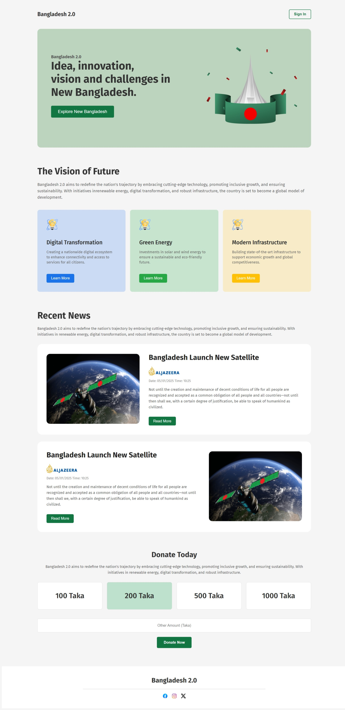

### Front Page Preview

### 1. Banner Section

- A visually appealing banner with:
  - **Background Color**: Creates contrast and grabs user attention.
  - **Heading and Text**: Positioned on the left to highlight key information.
  - **Image**: Placed on the right to complement the content.
  - **Alignment**: Proper use of margin and padding ensures all elements align as Figma.

---

### 2. The Vision of Future

- A section that presents three cards in a row with the following features:
  - **Distinct Backgrounds**: Each card has a unique background style.
  - **Image/Icon**: Adds a visual representation to each card.
  - **Title and Description**: Provides clear and concise information about the card's content.
  - **Buttons**: Styled with unique colors to differentiate actions.

### 3. Recent News

- A section for showcasing the latest updates with two well-designed cards:
  - **Card 1**: Displays an image on the left and content on the right.
  - **Card 2**: Displays an image on the right and content on the left.
  - Both cards include:
    - News Title and Details.
    - Channel Logo and Publication Time.
    - A button at the bottom for user interaction.

---

### 4. Donate For Bangladesh

- A call-to-action section with:
  - **Center-Aligned Title and Subtitle**: Focused messaging to drive donations.
  - **Four Cards in a Row**: Displays money details for different donation options.
  - **Full-Width Input**: Includes a placeholder for user input.
  - **Center-Aligned Button**: Makes the action prominent and user-friendly.

---

### 6. Hover Effects on Page

- Interactive hover effects across the site:
  - On Card have a default background.
  - Donate section cards change background on hover.
  - Buttons feature hover animations to enhance interactivity.

---

# Technology

- HTML & CSS only
